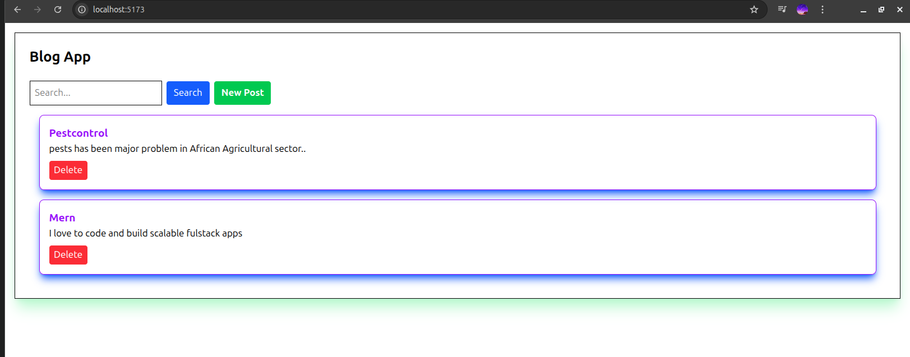
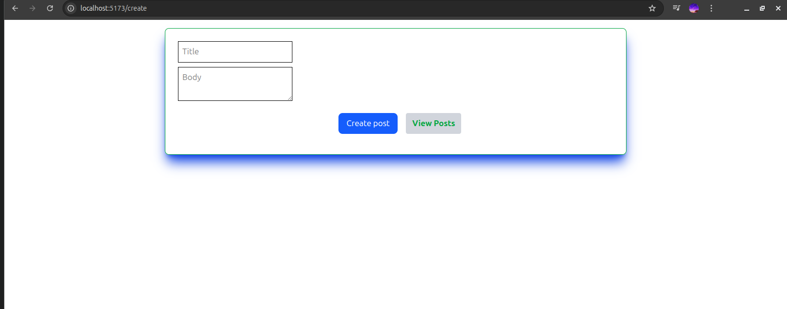

📦 Full Stack Blog App (MERN)
🚀 Overview
This is a full-stack Blog application built from scratch using modern web technologies.
Users can create, view, search, and delete blog posts with real-time interaction between frontend and backend.

✨ Features
🧠 Backend (API)
📝 Create blog posts

📚 Get all posts

🔍 Search posts (by keyword)

📄 Get single post

✏️ Update post

❌ Delete post

⚡ MongoDB database (persistent storage)

🎨 Frontend (React)
🏠 View all posts

➕ Create new post

📖 View single post details

❌ Delete post from UI

🔍 Search posts

🔄 Real-time UI updates

🧱 Tech Stack
Frontend
React

Vite

React Router DOM

Tailwind CSS (optional)

Backend
Node.js

Express.js

MongoDB

Mongoose

📁 Project Structure
Backend
blog-backend/
├── config/
│   └── db.js
├── controllers/
│   └── postController.js
├── models/
│   └── Post.js
├── routes/
│   └── postRoutes.js
├── .env
└── server.js
Frontend
blog-frontend/
├── src/
│   ├── pages/
│   │   ├── Home.jsx
│   │   ├── CreatePost.jsx
│   │   └── PostDetails.jsx
│   ├── components/
│   │   └── PostCard.jsx
│   └── App.jsx
⚙️ Installation & Setup
1️⃣ Clone Repository
git clone https://github.com/naptile/Blog-App.git
cd blog-app
2️⃣ Backend Setup
cd blog-backend
npm install
Create .env file:

PORT=5000
MONGO_URI=your_mongodb_connection_string
Run backend:

node server.js
3️⃣ Frontend Setup
cd blog-frontend
npm install
npm run dev
Frontend runs on:

http://localhost:5173
🌐 API Endpoints
GET    /api/posts            → Get all posts
GET    /api/posts/:id        → Get single post
POST   /api/posts            → Create post
PUT    /api/posts/:id        → Update post
DELETE /api/posts/:id        → Delete post
🔍 Search & Filtering
/api/posts?keyword=react
/api/posts?limit=5
🧠 Key Concepts Learned
Full CRUD operations

REST API design

React state management

React Router (dynamic routing)

Backend architecture (MVC pattern)

MongoDB & Mongoose

Frontend ↔ Backend integration

Handling forms & API requests

🖼️ Screenshots

🚀 Future Improvements
🔐 Authentication (Login/Register)

❤️ Like & comment system

🧾 Rich text editor

🌐 Deployment (Vercel / Render)

📱 Responsive design improvements

👨‍💻 Author
Naptile Peter

⭐ Support
If you like this project, give it a ⭐ on GitHub!

